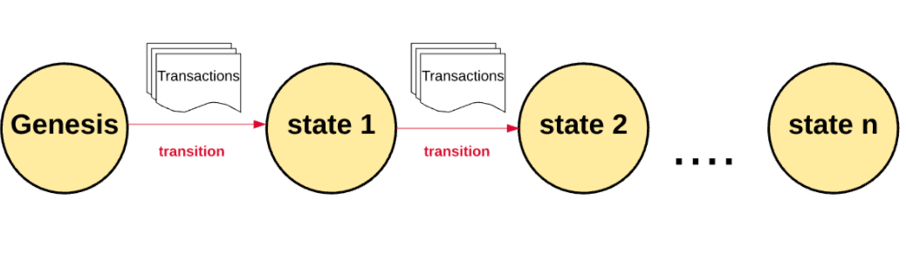

区块链是一种分布式的、数字的、不可变的账本，用于以安全透明的方式记录交易和存储数据。它基于一个分散的节点网络，这些节点共同维护一个单一的真相来源，允许参与者在不需要中介的情况下与系统交互。

区块是一种容器数据结构，用于聚合交易，以包含在公共账本（区块链）中。链中的每个区块都包含一组交易，这些交易已由节点网络通过一个称为共识的过程进行验证和记录。一旦区块被添加到链中，它就不能被更改或删除，从而创建网络上所有交易的不可变记录。

区块链由匿名人士（或团体）中本聪在 2009 年发布比特币网络时普及。比特币是一种加密货币网络，它主要处理 BTC 资产在网络上的转移，无需可信的中间人或权威机构， 同时确保网络本身安全且不会被黑客攻击。（比特币网络也可能是世界上最大的漏洞赏金——如果你能破解它，你就会立即成为万亿富翁）。

随着时间的推移，比特币的这种设计激发了其他功能更强大的区块链网络的出现，比如以太坊 我们将在接下学习很多有关以太坊的知识。

状态管理

区块链在启动时以创世纪状态开始。比特币的起源状态发生在2009年公共网络推出时。以太坊的创世纪状态发生在2015年。区块链上的每一笔交易都会修改在所有节点上复制的全局状态。

由于有数百万笔交易，交易被分组成块，因此得名区块链。这些区块以可加密验证的方式链接在一起，因此它们具有历史可追溯性。网络的当前状态可以在任何时候重新计算，方法是从起源块开始，并根据每个块的信息转换状态，直到现在。

区块链网络是通过计算机节点的对等分布式网络自主管理的。不需要过多的细节，可以简单地将网络中的每个节点视为保存全局交易分类账的副本。因此，每个节点都可以单独验证和审计网络上发生的交易，并确保没有非法行为。
另一种类型的节点称为挖矿节点，负责将网络上进行的新交易分为一个块，对其进行验证，并建议其他人将该块包括在全球账本中。挖矿在计算上很困难，而且安全地进行非常重要，因此区块被接受的矿工会因其辛勤工作而获得象征性奖励。

区块链的使用证实了每个价值单位只转移了一次，中本聪提出的巧妙机制解决了长期存在的去中心化双重支出问题。

通过将数据存储在节点的对等网络中，区块链是一个去中心化的网络。与以集中方式存储数据的传统方法相比，这具有显著的优势。集中化问题有一些重要的例子，我们将在这里列出其中的一些：
- 集中式系统中的数据泄露暴露了大量数据。
- 中央集权机构可以审查和关闭言论。
- 对中央机构的依赖意味着上游问题会影响下游消费者（例如，AWS倒闭意味着大部分互联网也随之倒闭）

另一方面，权力下放带来了好处。
- 没有审查制度，因为没有一个权威机构或中间人可以审查你。
- 没有停机时间，因为整个网络在全球1000个节点上运行。
- 高度抗攻击性，使操作或销毁数据变得不可行

使用案例有：1.加密货币 2. 智能合约 3. 去中心化金融 4. 游戏 5. 供应链跟踪 6. 防伪保护 7. 数据隐私 8. 分权治理 9. 可核实的资产所有权

其它资料

[But how does bitcoin actually work? by 3Blue1Brown](https://www.youtube.com/watch?v=bBC-nXj3Ng4)
[Blockchain Demo by Anders Brownworth](https://andersbrownworth.com/blockchain/)
[Secure Hash Algorithm](https://en.wikipedia.org/wiki/Secure_Hash_Algorithms)
[Byzantine General problem](https://river.com/learn/what-is-the-byzantine-generals-problem/)
[A Gentle Introduction to Blockchain Technology by Bits On Blocks](https://bitsonblocks.net/2015/09/09/gentle-introduction-blockchain-technology/)
[How does a blockchain work by Simply Explained](https://www.youtube.com/watch?v=SSo_EIwHSd4)